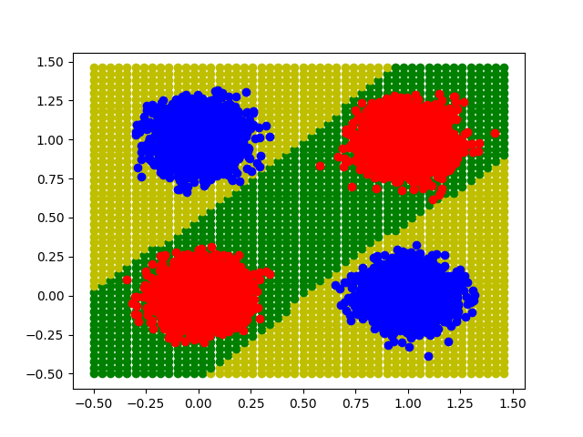
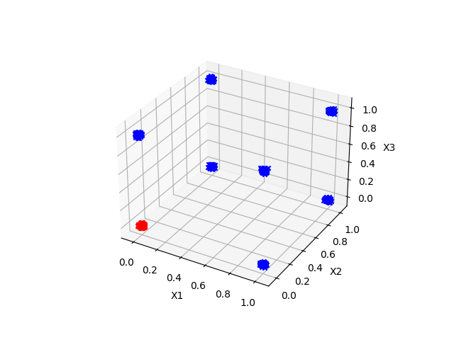
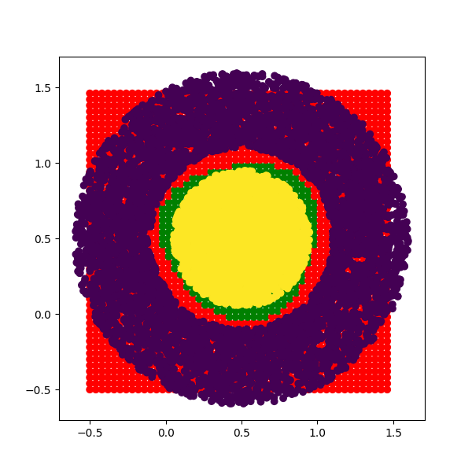

# Multi Layer Perceptron and other stuff!

This small project tries to develop a toy machine learning library using numpy facilities to treat tensors

## Files

- 'neural_net.py' is the file that includes the basic class untill now, other files use it's functions to solve the famous XOR problem and another 3d boolean function

## Example Plots

Here are the example plots generated by the script:

## XOR:

## A or B or C:

## Rings:

